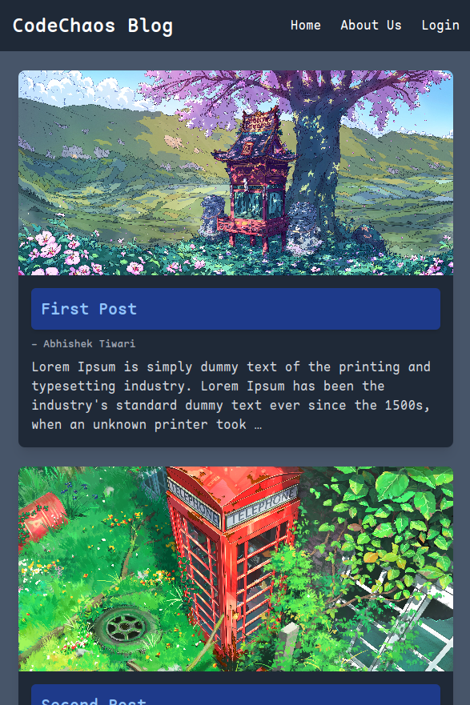
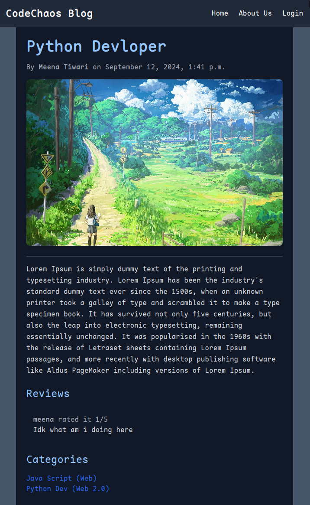

# Codechaos Blog

**Codechaos Blog** is a personal blogging application built with Django and styled with Tailwind CSS. This application allows only the creator (you) to post content, providing a private space for your thoughts, updates, and articles.

## Features

- **Personal Blog**: Only you can create and manage blog posts.
- **Tailwind CSS**: Modern and responsive styling with Tailwind CSS.
- **Django Admin**: Simple and powerful backend for managing posts.

## Getting Started

Follow these steps to get the project up and running on your local machine.

### Prerequisites

- Python 3.8+
- Django 4.0+
- Node.js (for Tailwind CSS)

### Installation

1. **Clone the Repository**

   ```bash
   git clone <repository-url>
   cd codechaos-blog
   ```

2. **Set Up a Virtual Environment**

   ```bash
   python -m venv env
   source env/bin/activate  # On Windows, use `env\Scripts\activate`
   ```

3. **Install Python Dependencies**

   ```bash
   pip install -r requirements.txt
   ```

4. **Install Node.js Dependencies**

   ```bash
   npm install
   ```

5. **Run Migrations**

   ```bash
   python manage.py migrate
   ```

6. **Collect Static Files**

   ```bash
   python manage.py collectstatic
   ```

7. **Run the Development Server**

   ```bash
   python manage.py runserver
   ```

8. **Access the Application**

   Open your browser and go to `http://127.0.0.1:8000/`.

## Project Structure

- `blog_project/` - Main project folder
  - `blog/` - Blog app folder
  - `static/` - Static files (CSS, JS, images)
  - `templates/` - HTML templates
  - `manage.py` - Django management script
  - `requirements.txt` - Python dependencies

## Tailwind CSS Integration

1. **Install Tailwind CSS**

   Follow the [Tailwind CSS installation guide](https://tailwindcss.com/docs/guides/django) to integrate Tailwind CSS with Django.

2. **Configure Tailwind CSS**

   - Update `tailwind.config.js` to include your custom configurations.
   - Add Tailwind CSS directives to your main CSS file.

3. **Build Tailwind CSS**

   ```bash
   npm run build
   ```

## Usage

As the only user, you can manage your blog posts through Django's admin interface. Log in with the admin credentials and navigate to the blog posts section to create, edit, or delete posts.

## Video

[](https://youtu.be/AMWuTu9Sdww)

## Screenshots



*Homepage view of the Codechaos Blog.*


*A sample blog post.*

## License

This project is licensed under the MIT License - see the [LICENSE](LICENSE) file for details.

## Contributing

If you'd like to contribute to this project, please fork the repository and submit a pull request with your changes.

## Acknowledgments

- [Django](https://www.djangoproject.com/) - High-level Python web framework
- [Tailwind CSS](https://tailwindcss.com/) - Utility-first CSS framework

---

